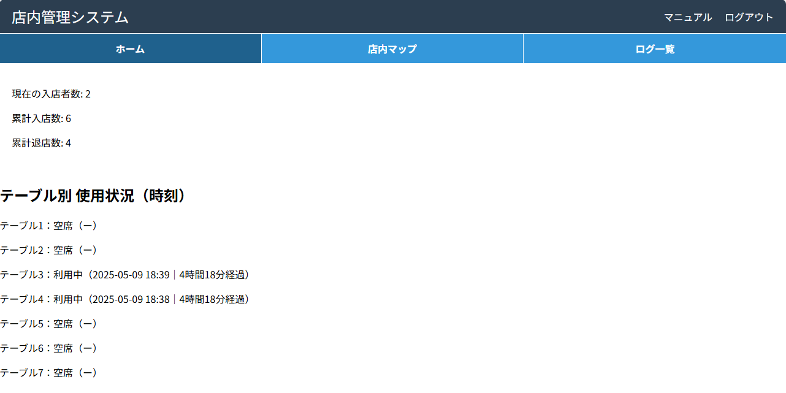

<!DOCTYPE html>
<html lang="ja">
<head>
  <meta charset="UTF-8" />
  <meta name="viewport" content="width=device-width, initial-scale=1.0" />
  <title>混雑可視化システム スタートページ</title>
  
</head>
<body>
  <header>
    
混雑可視化システム

    <a href="#">ReadMe →</a>
  </header>

  <main class="hero">
    <!-- ※画像は `index-preview.png` などに差し替えてください -->
    

    

      このプロジェクトは、QRコードを用いて入退店を記録し、 
      店舗の混雑状況をリアルタイムに可視化するWebアプリケーションです。 
      各テーブルにQRコードを設置し、入店・退店時にスマホで読み取ることで、 
      管理者は現在の混雑状況を一覧で把握できます。
    

    <a class="button" href="index.html">使ってみる</a>
  </main>

  <footer>
    
©2024 東京市立大学 メディア情報学部 情報システム学科 Daiki Komuro

    

      <a href="#">先行研究</a>
      <a href="https://github.com/Mimichan33/QR-webpage/tree/main" target="_blank">GitHub</a>
      <a href="#">Docs</a>
    

  </footer>
</body>
</html>
